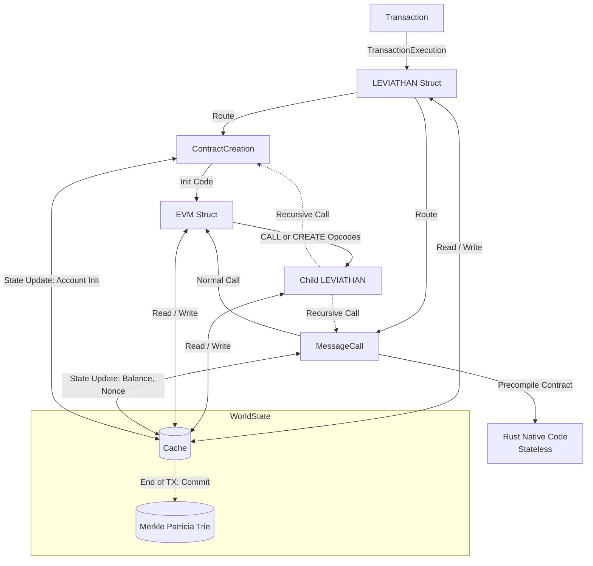
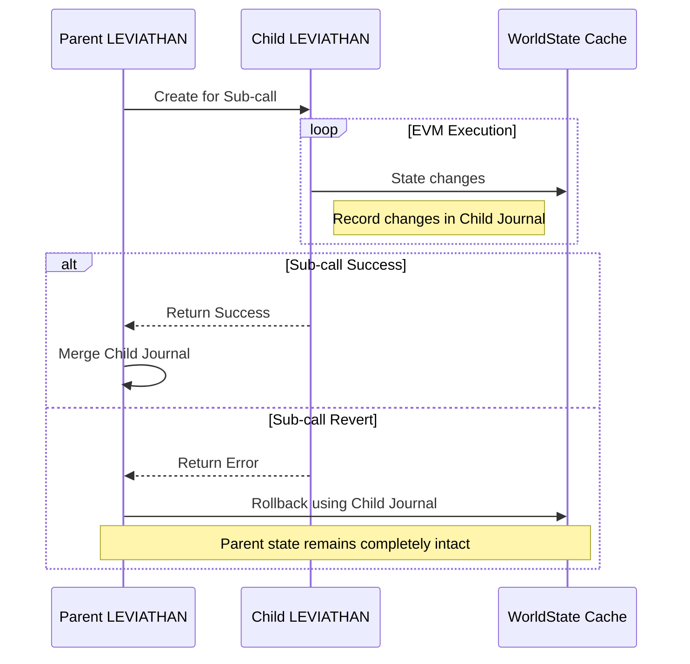
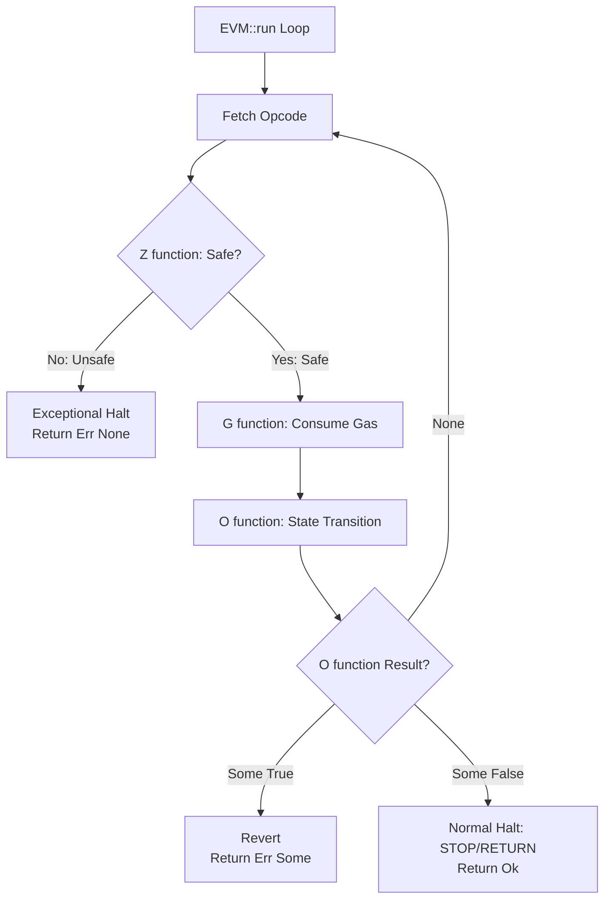

# Leviathan

**An Enterprise-Grade TEE × ZK Hybrid EVM in Rust**

Leviathanは、行政手続きや公共インフラ（選挙、給付金分配など）の完全自動化 **「無人の市役所」** の実現を目指してフルスクラッチ開発された、行政・エンタープライズ特化型のカスタムEVM（Ethereum Virtual Machine）です。

パブリックチェーンにおける「ガス代によるプライバシー漏洩」や「実行速度の限界」といったプロトコルレベルの課題を解決するため、EVMコアのプレコンパイルレイヤーに直接ゼロ知識証明（ZK-SNARKs）とRSA検証を組み込む次世代の暗号インフラとして設計されています。

## Vision: 現代のリヴァイアサン（無人の市役所）の構築
人の手が介在せず、私欲を持たず、ただデプロイされたコードという「法」に従って恒久的に動き続ける改ざん不可能なシステム。
私はEVMが持つこの「トラストレスな絶対性」に強烈に惹かれました。

透明性が極限まで求められ、恣意的な運用が絶対に許されない「行政手続き（選挙や給付金分配など）」は、スマートコントラクトと最も相性が良い領域です。
本プロジェクトは、特定の管理者に依存しない究極の民主主義インフラ、すなわち現代の「リヴァイアサン」を構築する試みです。
この自律型インフラの深淵をブラックボックスとしてではなく、ソースコードレベルで完全に理解・支配するため、Ethereum Yellow Paperの数学的定義に基づくフルスクラッチ開発を決意しました。

**【独自性：身元証明と完全匿名のハイブリッド統合】**
行政インフラを現実社会に実装するためには、「システムの透明性」と同時に、時には相反する「個人の絶対的な匿名性」が不可欠です。
例えば，選挙においては誰の票であるかは完全に秘匿しつつ、「正規の有権者が1回だけ投票した」ことのみを数学的に証明しなければなりません。

日本にはすでに「マイナンバーカード」という強固な身元証明基盤が存在します。
私はこの事実に着目し、「マイナンバーのRSA署名による確実な身元証明」と「ZK-SNARKsによる完全匿名性」を両立させるプロトコルの需要に辿り着きました。
この重い暗号処理をガス代高騰の原因となるSolidity（アプリケーション層）で処理するのではなく、EVMコアの「プレコンパイルコントラクト」としてRustでネイティブに統合すること。
これこそが、本プロジェクト最大のオリジナリティであり、既存のパブリックチェーンには実現できないエンタープライズ特化型エンジンの真価です。

##  Core Features
* **Built entirely in Rust:** 低レイヤーのメモリ安全性と極限のパフォーマンスを追求したフルスクラッチの実行エンジン。
* **Native ZK & RSA Precompiles:** スマートコントラクト（Solidity）層ではなく、EVMコアに直接暗号検証ロジック（RSA-2048, BN254等）をプレコンパイルとして統合し、圧倒的なガス代最適化と処理の高速化を実現。
* **Gasless Meta-Transactions via Relayer:** ユーザーのトランザクションはRelayerを経由してEVMにルーティングされ、送信元のIPやアドレスを完全に秘匿。
* **Cryptographically Provable State:** HashMap等の仮構想を完全に脱却し、公式StateTestをパスする厳密な Merkle Patricia Trie (MPT) をネイティブ実装。

##  Architecture & Data Flow

本EVMの最大の特徴は、トランザクションの実行コンテキスト（Cache）と暗号学的な状態保管庫（MPT）の厳格な分離、およびカスタムプレコンパイルへのルーティング機構にあります。

### Transaction Execution Flow

本EVMアーキテクチャの最大の特徴は、実行エンジンであるLEVIATHANと、状態管理を担うWorldStateの厳格な分離です。
トランザクションが入力されると、LEVIATHANがルーターとして機能し、ContractCreation（初期化）またはMessageCall（実行）へと処理を振り分けます。実行中の状態変化（ストレージの書き換えなど）はすべてインメモリのCacheに対して行われます。トランザクションが完全に成功し、すべての処理が終了した最後の瞬間にのみ、Cacheの内容が暗号学的な保管庫であるMerkle Patricia Trie (MPT)へとコミットされます。これにより、不要なディスクI/Oを排除し、極めて高いパフォーマンスと状態の整合性を両立しています。

### Recursive Journaling & Rollback

スマートコントラクトでは「コントラクトAがBを呼び、BがCを呼ぶ」といった複雑なネスト（サブコール）が頻繁に発生します。この際、もし大元の呼び出しでエラーが起きれば、それまでの状態変化をすべて無かったこと（リバート）にしなければなりません。
EVM実装では、状態全体のスナップショットを都度作成するアプローチとジャーナルによるアプローチが考えられます。
スナップショットは実装が単純でバグも少なく実装できる反面、パフォーマンスのボトルネックになるという欠点が存在します。

本プロジェクトではこれを解決するため、「子LEVIATHAN構造体」による再帰的なジャーナル（Cacheに対する変更履歴の記録）管理を採用しています。サブコールが発生するたびに子インスタンスが生成され、そのコンテキスト内でのみ変更内容が記録されます。

- 正常終了時（Success）： サブコールが成功した場合、子LEVIATHANが記録したジャーナルを、そのまま親のジャーナルに統合（Merge）します。
- 例外停止・Revert時（Failure）： 失敗した場合は、子LEVIATHANのジャーナル履歴を逆再生し、Cacheを正確に元の状態に巻き戻します。

【複雑なロールバックも完全に制御】
この設計の真価は、深いネスト構造において発揮されます。
例えば、「子1」がさらに「子2」「子3」を呼び出したとします。子2と子3が正常終了して履歴が子1にMergeされた後、最終的に大元の「子1」が例外停止（またはRevert）したとします。この場合でも、統合済みの「子1」のジャーナルを巻き戻すだけで、子2・子3が行ったCacheへの変更も含めてすべて完璧にロールバックされます。

これにより、メモリオーバーヘッドを極限まで削りつつ、どれほど複雑な階層でも安全な状態復元を実現しています。

### EVM Core Engine

EVMコアのメインループ（EVM::run）は、Ethereum Yellow Paperに記述された数学的定義をRustの関数として極めて忠実に再現しています。
各オペコードの実行は、以下の明確な責務を持つ3つの関数フェーズに分割されています。

- **Z function (is_safe)**: スタックやメモリの安全性を検証し、違反があれば即座に例外停止（Exceptional Halt）させます。
- **G function (gas)**: EIP-150等の仕様に基づき、複雑なガス計算を行います。
- **O function (execution)**: G functionで計算したガスを消費し，実際の状態遷移を実行し、処理の継続、正常終了（STOP/RETURN）、または明示的なリバートを制御します。

ZとG functionはイエローペーパーの定義通りState及びVMの状態を遷移させない．
このように関数の責務をプロトコルレベルで完全に分離することで、エッジケースのバグを排除し、ハードフォークごとの仕様変更に対しても極めて高い保守性を誇ります。

## Technical Execellence: Rust Idiomatic Design 
単に「動く」だけでなく、長期的な保守性と拡張性を担保するためのRustらしい設計を徹底しています。

### Stateトレイトによる抽象化と「換装可能性」の担保
開発初期、デバッグの効率化のためにWorldStateは単純な HashMap で構築されていました。しかし、最終的に Merkle Patricia Trie (MPT) への換装が不可欠であることを予見し、実行エンジンがStateに依存しないよう State トレイトによる抽象化 を実施しました。

**成果**: 実際に HashMap から MPT へのデータ構造換装を行った際、コアとなる実行エンジン（EVM Core）のコードには一行も手を加えることなく移行を完了しました。これは、責務の分離とトレイト境界による制約が正しく機能した証左です。

## Technical Philosophy (ADR)
本プロジェクトは既存EVMの単なるクローンではなく、スケーラビリティ・仕様準拠・保守性を極限まで担保するため、以下のアーキテクチャ設計を採用しています。

### O(1) ロールバックを実現するジャーナルベースの状態管理

スマートコントラクトの実行において、サブコール（CALL等）失敗時の状態（State）リバートはパフォーマンスのボトルネックになります。
本EVMでは、状態全体のディープコピーを避け、ジャーナル（変更履歴）ベースのロールバック機構を採用しました。トランザクションのコア実行構造体内部に直接ジャーナルを保持させることで、状態の逆再生（Undo）のみでメモリオーバーヘッドなく正確な復元を可能にしています。

### 厳密なYellow Paper準拠による関数マッピング

EVMの複雑な仕様とエッジケースを正確にハンドリングするため、Ethereum Yellow Paperの数学的定義をRustのモジュール単位に直接落とし込んでいます。仕様書とソースコードの対応関係を透過的にすることで、極めて高い堅牢性とデバッグの容易性を確保しました。

### ハードフォークの動的切り替え（VersionId）

列挙型 VersionId を実行環境に導入し、Frontierから最新仕様までのオペコードやガス代の変更を単一のコードベースで共存させています。ブランチを分けることなく、動的にプロトコルバージョンを切り替えてテスト・実行が可能です。

### モダンな型システムとオーバーフローの完全排除

数値型には最新の alloy_primitives::{U256, I256} を採用。また、メモリ拡張コストの計算時など、悪意ある巨大な入力による整数オーバーフロー攻撃を防ぐため、境界チェックにはRustの saturating_add などを徹底し、セキュアな算術演算を実装しています。

## Case Studies: Overcoming Protocol-Level Challenges

### EIP-150 (63/64 Rule) と関数の厳格な責務分離

親コントラクトから子へガスを渡す際、要求ガスが親の残量を超える場合の挙動の差異を実装するにあたり、実行フェーズでのアドホックな例外処理を排除しました。すべてをガス計算モジュールの中で完結させ、計算された許容ガス量を実行コンテキストに一時的に保持（キャッシュ）させるアーキテクチャを採用し、フォーク間の複雑な状態遷移を解決しました。

### 再帰制限 (Depth 1024) の突破とコンパイラレベルのメモリ最適化

公式の StateTest における 1024階層の再帰呼び出しテストにおいて、巨大な match 式によるRustコンパイラのローカル変数の一括スタック確保仕様が原因となるスタックオーバーフローに直面しました。
重いOpcode処理の別関数への切り出しと #[inline(never)] の付与、および子EVMインスタンスのヒープ退避（Box::new()）を実施し、1階層あたりのスタック消費を劇的に圧縮して再帰テストを突破しました。

## Testing Methodology: The Roadmap to Reliability
本プロジェクトのテストプロセスは、開発フェーズ（Stateの実装方式）に合わせて段階的に構築されています。単に「テストを通す」ことだけではなく、実装の変更に対して「デグレード（退行）が起きていないか」を数学的に検証することを重視しています。

### Phase 1: HashMap State & Filler-based Testing
開発初期、State（状態管理）を HashMap で実装していた段階では、公式テストスイートの中でも "Filler" ファイルを主軸に検証を行いました。

- LLL自動コンパイルへの限定: テスト用bytecodeの生成において、LLL（Lisp Like Language）の自動コンパイル環境に対応しているソースのみを抽出して実行しました。
- Status-based Verification: Fillerファイルはテスト結果がハッシュ値ではなく「最終的なステートの状態（NonceやBalanceなど）」で定義されています。MPT実装前の段階では、この明示的な状態値を突き合わせることで、実行エンジンの論理的な正しさを担保しました。
- Scope: このフェーズでは、公式が提供する全テストセットの網羅ではなく、あくまでコアエンジンの基本動作を確実に固めることを優先しました。

### Phase 2: Transition to MPT & Consistency Verification
tateを Merkle Patricia Trie (MPT) へ換装した現在のフェーズでは、　**「HashMap版でパスした全テストを、MPT版でも完全に突破すること」** を当面の絶対目標としています。

- テストセットの継続性: 検証の整合性を保つため、MPT版においてもHashMap版で抽出したテストベクタと同じバリエーションを使用しています。
- Hash-based Verificationへの布石: MPTの実装により、最終的な StateRoot（ハッシュ値）による厳格な検証が可能となりました。現在は、先行してパスしていたFillerベースのテストをMPT環境で再走させ、MPTへの換装が実行ロジックに悪影響を与えていないことを、パス率 100% の維持によって証明しています。

## Testing & Compliance
本プロジェクトの実装精度を検証するため、ethereum/legacytests の Constantinople Snapshot を採用しています。
本エンジンは、Frontier から ConstantinopleFix (Petersburg) までの各フォーク仕様に基づいた GeneralStateTests を実施しています。

特に優先度の高い重要項目（元のリストで大文字だったもの）は、**太字**で強調しています。

### A - G
| テストスイート | 進捗 | 備考 |
| :--- | :---: | :--- |
| stArgsZeroOneBalance | ❌ | 全ファイルがyml形式のため実行不可 |
| stAttackTest | ✅ | **Pass** (現在ファイルが2/14ケース) |
| stBadOpcode | ✅ | **Pass** (現在ファイルが1/582ケース) |
| stBugs | ✅ | **Pass** (現在ファイルが4/38ケース) |
| **stCallCodes** | ✅ | **Pass** (ファイルが79・328ケース） |
| **stCallCreateCallCodeTest** | ✅ | **Pass** (39ファイル・168ケース) |
| **stCallDelegateCodesCallCodeHomestead** | ✅ | **Pass** (58ファイル・244ケース） |
| **stCallDelegateCodesHomestead** | ✅ | **Pass** (58ファイル・247ケース）|
| stChangedEIP150 | ✅ | **Pass** (30ファイル・159ケース) |
| stCodeCopyTest | 🔄 | 未着手 |
| stCodeSizeLimit | ✅ | **Pass** (3ファイル・19ケース) |
| **stCreate2** | ✅ | **Pass** (30ファイル・201ケース) |
| **stCreateTest** | ✅ | **Pass** (29ファイル・331ケース）|
| stDelegatecallTestHomestead | ✅ | **Pass** (28ファイル・125ケース) |
| stEIP150Specific | 🔄 | 未着手 |
| stEIP150singleCodeGasPrices | 🔄 | 未着手 |
| stEIP158Specific | ✅ | **Pass** (7ファイル・30ケース) |
| stExample | 🔄 | 未着手 |
| stExtCodeHash | ✅ | **Pass** (6ファイル・40ケース) |

### H - O
| テストスイート | 進捗 | 備考 |
| :--- | :---: | :--- |
| stHomesteadSpecific | ✅ | **Pass** (5ファイル・20ケース) |
| **stInitCodeTest** | ✅ | **Pass** (16ファイル・120ケース) |
| stLogTests | ✅ | **Pass** (46ファイル・322ケース) |
| stMemExpandingEIP150Calls | 🔄 | 未着手 |
| **stMemoryStressTest** | ✅ | **Pass** (38ファイル・287ケース）|
| **stMemoryTest** | ✅ | **Pass** (58ファイル・406ケース) |
| stNonZeroCallsTest | 🔄 | 未着手 |

### P - S
| テストスイート | 進捗 | 備考 |
| :--- | :---: | :--- |
| stPreCompiledContracts | ❌ | Balance不一致 |
| stPreCompiledContracts2 | ❌ | Balance不一致 |
| stQuadraticComplexityTest | ✅ | **Pass** (16ファイル・124ケース) |
| stRandom | ✅ | **Pass** (313ファイル・1250ケース) |
| stRandom2 | 🔄 | 未着手 |
| stRecursiveCreate | ✅ | **Pass** (2ファイル・12ケース) |
| **stRefundTest** | ✅ | **Pass** (19ファイル・166ケース） |
| stReturnDataTest | ❌ | MLOADの値が不一致 |
| **stRevertTest** | ✅ | **Pass** (43ファイル・1188)|
| **stSStoreTest** | ✅ | **Pass** (1ファイル・2ケース) |
| stShift | ✅ | **Pass** (40ファイル・268ケース） |
| **stSolidityTest** | ✅ | **Pass** (16ファイル・38ケース）|
| stSpecialTest | ❌ |   |
| stStackTests | ✅ | **Pass** (7ファイル・637ケース） |
| stStaticCall | ❌ | 呼び出し元の残ガスが6ガス相違 |
| stSystemOperationsTest | 🔄 | 挙動確認中 |

### T - Z
| テストスイート | 進捗 | 備考 |
| :--- | :---: | :--- |
| stTimeConsuming | ✅ | **Pass** (1ファイル・6ケース） |
| stTransactionTest | 🔄 | 一部検証中 (△) |
| stTransitionTest | ✅ | **Pass** (6ファイル・42ケース） |
| **stWalletTest** | ✅ | **Pass** (42ファイル・169ケース) |
| stZeroCallsRevert | ✅ | **Pass** (16ファイル・48ケース） |
| stZeroCallsTest | ✅ | **Pass** (24ファイル・168ケース） |
| stZeroKnowledge | ❌ | 0x00 ~ 0006 でエラーあり |
| stZeroKnowledge2 | 🔄 | 未着手 |

## Current Status & Roadmap

現在、PoCに向けたコアエンジンの検証フェーズを完了し、暗号統合フェーズを実行中です。

[x] Phase 1: Core Engine & MPT Integration
- EVM実行エンジンの構築と公式 GeneralStateTests の広範なパス。
- HashMapレイヤーの排除と、Merkle Patricia Trie (MPT) を用いた StateDB の完全統合。

[ ] Phase 2: ZK & Cryptography Integration
- CircomによるZK回路の作成（Commitment / Nullifier）。
-  Rustの暗号ライブラリを用いたRSA / BN254プレコンパイルの本格統合。

[ ] Phase 3: Relayer & Frontend Integration
- メタトランザクションを処理するRelayer APIの構築。
- 有権者登録・匿名投票用のフロントエンド構築。

[ ] Phase 4: TEE Integration (Future Work)
SGX等のTEE環境を利用した実行環境の完全秘匿化へのリサーチ

## Tech Stack
- Core: Rust
- EVM Components: Custom Implementation, alloy_primitives, alloy_rlp
- Cryptography: ZK-SNARKs (Circom), RSA-2048, BN254
- Frontend / Middleware: React, Node.js

### Why Rust & Full-Scratch?
次世代の行政インフラを構築するにあたり、以下の理由から実行エンジンの開発言語としてRustを選定しました。

1. **論理エラーの純化と絶対的なメモリ安全:**
   Rustの強固な所有権モデルにより、コンパイルを通過したコードからは「メモリリーク」や「データ競合」といった致命的な未定義動作が数学的に排除されます。これにより、開発者はEVMの仕様に起因する「論理的なバグの解決」のみに100%の思考リソースを集中させることができます。
2. **ZK・TEEエコシステムとの圧倒的な親和性:**
   Circomやarkworks等の最先端のゼロ知識証明エコシステム、およびSGX等のTEE（Trusted Execution Environment）開発において、Rustは事実上の標準言語（デファクトスタンダード）です。独自の暗号ロジックをネイティブ統合する本プロジェクトにおいて、Rustは唯一にして最強の選択肢です。
3. **アセンブリ・低レイヤー開発の経験値とのシナジー:**
   過去にアセンブリ言語を用いてOSをスクラッチ開発した経験から、スタックマシンの挙動、メモリレイアウトの設計、およびハードウェアリソースを直接意識した開発を得意としています。この低レイヤーの知見が、Rustの厳しいコンパイラと極めて高いシナジーを生み、EVMという巨大なステートマシンの高速な実装を可能にしています。

## About the Author
Taku Hashimoto
土木工学（都市計画）と生命科学（細胞小器官と疾患）という異分野のバックグラウンドを持つ。
過去にアセンブリ言語でOSをスクラッチ開発した経験から得た低レイヤー・メモリ管理の知見を活かし、次世代の社会インフラとなる暗号プロトコルの構築中。
